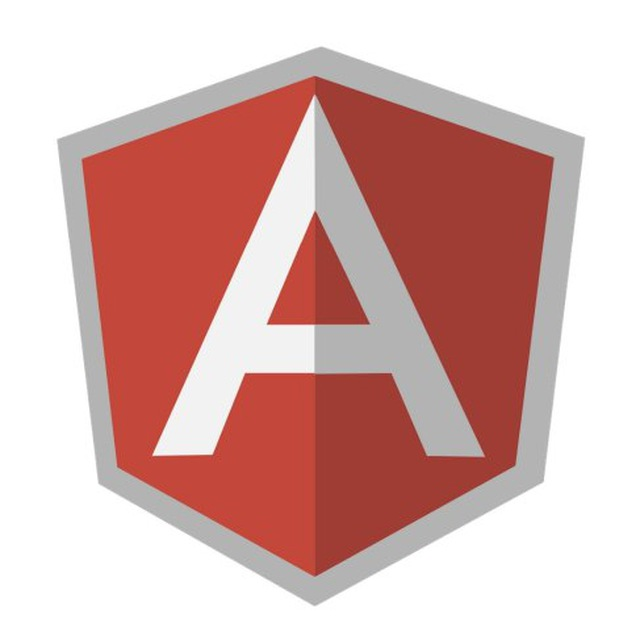

Это - список русскоязычных чатов об IT.

Общие правила
-------------

* не используйте список для найма сотрудников
* спам с предложениями работы запрещён (`перспективная-компания-лидер-рынка ишет 5 лет super senior swift developer`)
* используйте теги типа `@question` `@link`  `@offtop`
* почему так много чатов называются `<тема>-UA`? Читайте об этом [здесь](https://gist.github.com/listochkin/c81c198a2b7b044a0dc5).

Как помочь?
-----------
*Мы принимаем Pull Request'ы!*

Если вы знаете русскоязычный чат на IT-тематику, то добавьте ссылку и описание в файл `data.json`.

Список
------

| Название             | Коммьюнити | Технологии                      |   URL   | Правила участия |
|--------------------- | ---------- | ------------------------------- | ------- |       :-:       |
| **Laravel Framework** |  | Laravel Framework | Gitter: https://gitter.im/php-ua/laravel |  |
| **Atlassian User Group Saint-Petersburg** | [Atlassian User Group](https://aug.atlassian.com/st-petersburg) | Чат администраторов и разработчиков плагинов для продуктов Atlassian | Telegram: https://t.me/augspb | If you have interesting question about performance, plugin hacking, please, ask:) |
| **AI-ML-DS** |  [Dev UA](https://gitter.im/orgs/dev-ua/rooms) | Искусственный интеллект, машинное обучение, Data Science | Gitter: https://gitter.im/dev-ua/ai-ml-ds |  |
| **AllThatJS** |  | JavaScript | Slack: https://allthatjs.herokuapp.com |  |
| **Angular RUS** |  | AngularJS, Javascript | Gitter: https://gitter.im/angularjsrus/chat |  |
| **AngularJS UA** |  [Dev UA](https://gitter.im/orgs/dev-ua/rooms) | AngularJS, Javascript | Gitter: http://angular.im |  |
| **Angular.js — русскоговорящее сообщество** |  [Angular.js — русскоговорящее сообщество](https://telegram.me/angular_js) | AngularJS | Telegram: https://telegram.me/angular_js |  |
| **Android rus-speaking developers chat** |  | Android | Gitter: https://gitter.im/rus-speaking/android |  |
| **Android rus-speaking slack team** |  | Android | Slack: https://goo.gl/forms/YMWbVTvsESLyHWWH3 |  |
| **Android Developers - русскоговорящее сообщество** |  | Android | Telegram: https://telegram.me/android_ru |  |
| **Android United** |  | Android | Skype: http://bit.ly/androidchat |  |
| **Android Developers UA** |  | Android | Skype: https://join.skype.com/vG41lcKg7PtG |  |
| **Android Jobs UA - поиск вакансий Adroid в Украине** |  | Android | Telegram: https://t.me/joinchat/HMeR-xJoq6LkltufhEPK_g | Публикуем вакансии/резюме, ищем/публикуем проекты(задачи), колег в pet-проект, обсуждаем процес найма в Украине (ONLY ANDROID) |
| **Android Declarative** |  [Android Declarative — Чат русскоязычного android-сообщества, посвященный декларативным UI-фреймворкам: Jetpack Compose, Anko, Anvil, Litho](https://t.me/android_declarative) | Чат русскоязычного android-сообщества, посвященный декларативным UI-фреймворкам: Jetpack Compose, Anko, Anvil, Litho | Telegram: https://t.me/android_declarative |  |
| **Ansible RUS** |  | Ansible | Slack: https://goo.gl/vQfjzP | Slack register form:  [http://goo.gl/SBmI3F](http://goo.gl/SBmI3F) |
| **Android Dev Подкаст** |  | Комната для обсуждения Android Dev подкаста apptractor.ru/AndroidDev/ | Telegram: https://t.me/androiddevpodcast |  |
| **Android Architecture** |  | Русскоязычный чат по архитектуре в андроид приложениях. | Telegram: https://t.me/Android_Architecture |  |
| **#ru_embedded** |  | Embedded software/hardware на русском | Other: irc://irc.forestnet.org:6667/#ru_embedded |  |
| **#webdev** |  | Web-development theory and practice | Other: irc: http://webdev.a-ec.name |  |
| **.NET, C#, Azure** |  | .NET, ASP.NET, C#, Azure, Xamarin | Skype: http://bit.ly/dotnet-chat |  |
| **Atlassian User Group Moscow** | [Atlassian User Group](http://aug.atlassian.com/cities/moscowrussia) | Чат администраторов и разработчиков плагинов для продуктов Atlassian | Telegram: https://t.me/augmoscow |  |
| **PHP Community** |  | PHP Community | Gitter: https://gitter.im/php-ua/php |  |
| **Clojure UA** |  [Dev UA](https://gitter.im/orgs/dev-ua/rooms) | Clojure, Clojurescript,  FP | Gitter: https://gitter.im/dev-ua/clojure |  |
| **Cicerone Chat (RUS)** |  | Обсуждение библиотеки Чичероне: https://github.com/terrakok/Cicerone  | Telegram: https://t.me/Cicerone_RUS |  |
| **C++ Russia** |  | Обсуждение мероприятий, связанных с С++ в России | Telegram: https://telegram.me/joinchat/CMhk-j_waI8vac99lMYOFQ |  |
| **Clojure Ru** |  | Clojure, Clojurescript | Telegram: https://t.me/clojure_ru |  |
| **Clojure Pro** |  | Clojure, Clojurescript | Telegram: https://t.me/clojurepro |  |
| **Piter United** |  | Объединение ИТ-сообществ Санкт-Петербурга | Slack: http://bit.ly/piterunited |  |
| **DevOps — русскоговорящее сообщество** |  | Общаемся на темы DevOps, мониторинга, метрикам и облакам. Новости. | Telegram: https://t.me/devops_ru |  |
| **Dagger 2** |  | Группа для помощи, обмена опытом и лучшими практиками внедрения зависимостей при помощи Dagger 2.  | Telegram: https://t.me/dagger_2 |  |
| **Dart group** |  [Dev UA](https://gitter.im/orgs/dev-ua/rooms) | Dart | Gitter: https://gitter.im/dev-ua/dart Skype: http://bit.ly/dart-chat |  |
| **Cocoa Chat** |  | Cocoa | Skype: http://bit.ly/cocoa-chat | Read guidelines or be banned! |
| **Cocoa Developers Club** |  | iOS/OS X | Slack: http://cocoadevelopers.club/chat/ |  |
| **Delphi Developers UA** |  | Delphi | Skype: https://join.skype.com/bkLfxSCj6kWy |  |
| **DIY / Glory to the sad Robots** |  | Hardware, Microcontrollers, Robotics | Skype: http://bit.ly/robots-chat |  |
| **DevOps for Devs** |  | Vagrant, Docker, Dokku OH MY! | Skype: http://bit.ly/devops-for-devs |  |
| **Continuous Integration/Delivery RU** |  | Continuous Integration/Delivery на русском | Telegram: https://telegram.me/ci_cd_ru |  |
| **pro.js** |  [proDOT](https://telegram.me/proDOT) | Javascript, Node.js и многое-многое другое | Telegram: https://telegram.me/joinchat/Be4rsT5Rsgq30DHutjxXgA |  |
| **ITCrowd KZ** |  | Developers community of Kazakhstan | Slack: http://itcrowd-kz.slack.com/ |  |
| **Gentoo** |  | Сообщество пользователей ОС Gentoo Linux. | Telegram: https://t.me/russian_gentoo Other: http://telegra.ph/Info-06-11 |  |
| **Go Lang** |  [Dev UA](https://gitter.im/orgs/dev-ua/rooms) | Go | Gitter: https://gitter.im/dev-ua/go Skype: http://is.gd/0hu7AR |  |
| **How Programming Works** | Metarhia | Computer science, Software engeneering, Programming | Telegram: https://t.me/Programming_IP9X |  |
| **GraphQL** |  | Русскоговорящее сообщество GraphQL | Telegram: https://telegram.me/graphql_ru |  |
| **HangOps.ru** |  | Russian DevOps Hangouts | Slack: http://join.hangops.ru Skype: skype outdated: http://tinyurl.com/hangopsru |  |
| **Frontend KZ** |  | HTML5, CSS3, Javascript, ... | Slack: http://frontendkz.github.io/ |  |
| **Haskell UA** |  [Dev UA](https://gitter.im/orgs/dev-ua/rooms) | Haskell Chat | Gitter: https://gitter.im/dev-ua/haskell |  |
| **Haskell** |  | Haskell Chat | Gitter: https://gitter.im/ruhaskell/forall |  |
| **Haxe** |  | Haxe | Telegram: https://t.me/haxe_ru |  |
| **Hexlet** |  | CS, Java, Ruby, PHP, JS | Slack: http://slack-ru.hexlet.io/ |  |
| **How Games are made** |  | GameDev | Slack: http://hgam-invite.herokuapp.com/ |  |
| **Docker - русскоговорящее сообщество** |  | Обсуждаем вопросы, посвященные Docker, Docker Swarm и всей экосистеме. Обмениваем идеями, новостями и решаем пробемы. | Telegram: https://t.me/docker_ru |  |
| **ITChat** |  | Web scraping, Python | Skype: http://tinyurl.com/itchatnew |  |
| **Ember Chat** |  [Dev UA](https://gitter.im/orgs/dev-ua/rooms) | EmberJS | Gitter: https://gitter.im/dev-ua/ember |  |
| **Flask** |  | Русскоязычное сообщество Flask | Telegram: https://t.me/ru_flask |  |
| **Erlang / Elixir** |  | Erlang, Elixir | Slack: http://otp-russian.herokuapp.com/ Telegram: https://telegram.me/proelixir | Be nice. |
| **IT Perm - сообщество айтишников из П** |  [IT Perm](https://t.me/itperm) | Интересное из мира IT в Перми. Митапы, конференции, вакансии, дискуссии, интервью. | Telegram: https://t.me/itperm | Без мотиваторов, котиков, цитат и 1С. |
| **Feathers JS** |  | Русскоязычное сообщество Feathers.js | Telegram: https://t.me/featherjs |  |
| **Flow type checker community** |  | flow, js | Telegram: https://telegram.me/flowtype_ru |  |
| **Fronthub** |  | js, css, html, fun, flood | Slack: https://fronthub.slack.com |  |
| **GameDev без политоты** |  | GameDev | Skype: https://bit.ly/ru-gamedev-skype-chat |  |
| **Django** |  | Русскоязычное сообщество Django | Telegram: https://t.me/pydjango |  |
| **Ruby/RoR** |  [Dev UA](https://gitter.im/orgs/dev-ua/rooms) | Ruby, Rails | Gitter: https://gitter.im/dev-ua/ruby-ua Skype: http://bit.ly/ruby-ua Telegram: https://telegram.me/rubylang |  |
| **NodeUA** | Metarhia | Node.js and Software engineering | Telegram: https://t.me/nodeua |  |
| **JavaChat** |  | Java, JVM | Skype: http://bit.ly/javachatru |  |
| **Moxy – MVP библиотека под Android** |  | https://github.com/Arello-Mobile/Moxy Обсуждаем в группе вопросы, связанные с Moxy: - почему нужно пользоваться Moxy? - какие возможности есть у Moxy? - помогаем принять друг другу правильное решение определенной задачи - и т. д. | Telegram: https://t.me/moxy_ru |  |
| **Java talks BY** |  | Java, JVM, Software Design | Skype: http://bit.ly/javatalks-by |  |
| **Kotlin Community** |  | Сообщество разработчиков на Kotlin | Telegram: https://t.me/kotlin_lang |  |
| **Krasnodar Dev Days** |  | IT-сообщество Краснодара, организация конференций и митапов, а также освещение городских IT-событий | Telegram: https://telegram.me/krddevdays |  |
| **Krasnodar Frontend** |  | Cообщество frontend-разработчиков Краснодара | Telegram: https://telegram.me/krdfrontend |  |
| **Kubernetes - русскоговорящее сообщество** |  | Общаемся на темы, посвященные Kubernetes, конфигурации и возможностям. Новости, вопросы, идеи и т.д. | Telegram: https://t.me/kubernetes_ru |  |
| **ITишники во Владимире** |  | ИТ-сообщество города Владимира | Slack: http://anjlab.com/ru/vladimir8bit/ |  |
| **NodeJS UA** |  [Dev UA](https://gitter.im/orgs/dev-ua/rooms) | NodeJS + DevOps and NoSQL | Gitter: https://gitter.im/dev-ua/node |  |
| **NodeJS RUS** |  | NodeJS | Gitter: https://gitter.im/nodejsrus/chat |  |
| **MoscowJS** |  | HTML5, CSS3, Javascript | Gitter: https://gitter.im/moscowjs/chat |  |
| **Mobile Web UA** |  | Hybrid apps, Phonegap, Crosswalk ... | Skype: http://bit.ly/mobile-web-ua |  |
| **Lovely Clojure** |  | Clojure, Clojurescript,  FP | Skype: http://tinyurl.com/clj-cljs |  |
| **Laravel** |  | Laravel, PHP | Gitter: https://gitter.im/laravelrus/chat |  |
| **JavaScript Noobs** |  | Группа для новичков в JS и фронтенд-разработке | Telegram: https://telegram.me/js_noobs_ru |  |
| **Javascript.ru** |  | javascript, nodejs, angularjs, ... | Slack: http://slack.javascript.ru |  |
| **ScalaChat** |  [Dev UA](https://gitter.im/orgs/dev-ua/rooms) | Scala, JVM, Software Design | Gitter: https://gitter.im/dev-ua/scala Slack: https://scala-ru.herokuapp.com Skype: http://bit.ly/scalachat |  |
| **TRUE C++** |  [TRUE](https://habrahabr.ru/post/242683/) | C++ | Skype: http://goo.gl/tAjSf2 |  |
| **ReactiveX - русскоговорящее сообщество** |  | Общаемся на темы, посвященные реактивному программированию. | Telegram: https://t.me/reactivex |  |
| **Odeskconf** | undefined | Сообщество людей, практикующих удаленную работу и фриланс | Slack: https://odeskconf.herokuapp.com/ |  |
| **Python Community Chelyabinsk** |  | Сообщество Python-разработчиков Челябинска | Telegram: https://t.me/pychel |  |
| **Rollup** |  | Русскоязычное сообщество Rollup.js | Telegram: https://t.me/rollup_ru |  |
| **TRUE .NET** |  [TRUE](https://habrahabr.ru/post/242683/) | .NET | Skype: http://goo.gl/3lKLdJ |  |
| **TRUE Big Data** |  [TRUE](https://habrahabr.ru/post/242683/) | Big data/Data Science | Skype: http://goo.gl/N2Djvo |  |
| **Russian–speaking Ruby/JS dev community** |  | ruby, js | Slack: https://rusdevs.herokuapp.com |  |
| **TRUE Android Development** |  [TRUE](https://habrahabr.ru/post/242683/) | Android | Skype: http://goo.gl/V8cIca |  |
| **Phalcon RUS** |  | Phalcon, PHP | Gitter: https://gitter.im/phalcon-rus/chat |  |
| **Phalcon Framework** |  | Phalcon Framework | Gitter: https://gitter.im/php-ua/phalcon |  |
| **PHP UA** |  [Dev UA](https://gitter.im/orgs/dev-ua/rooms) | PHP | Gitter: https://gitter.im/dev-ua/php Skype: http://bit.ly/php-ua | Chat migrated to Gitter |
| **Pyha** |  | Сообщество форума pyha.ru | Slack: https://pyha.slack.com |  |
| **PHP Telegram** |  | PHP чат в telegram | Telegram: https://telegram.me/prophp7 |  |
| **Symfony** |  | Symfony Components, Symfony Framework | Telegram: https://t.me/symfony_php |  |
| **Symfony Framework RU** |  | Symfony Framework | Gitter: https://gitter.im/symfonysib/symfony |  |
| **Postgres.chat** |  | Чат о Postgres | Gitter: https://gitter.im/postgresmen/postgresqlrussia |  |
| **Symfony Framework UA** |  | Symfony Framework | Gitter: https://gitter.im/php-ua/symfony |  |
| **Spb Frontend** |  | js, css, html | Gitter:  https://gitter.im/spb-frontend/talks Slack: http://slack.spb-frontend.ru/ |  |
| **Scala User Group** |  | Telegram чат о Scala | Telegram: https://t.me/scala_ru |  |
| **TRUE ASM** |  [TRUE](https://habrahabr.ru/post/242683/) | Assembler | Skype: http://goo.gl/CvxDnR |  |
| **SwiftChat** |  | Swift, iOS, OSX | Skype: http://bit.ly/swift_skype_chat |  |
| **Scala UA** |  [Dev UA](https://gitter.im/orgs/dev-ua/rooms) | Scala, JVM | Gitter: https://gitter.im/dev-ua/scala Skype: http://bit.ly/scala-ua | Skype is a read-only archive |
| **Startups** |  | Startups, Entrepreneurship | Skype: http://bit.ly/startups-ua-chat |  |
| **Python** |  | Python сообщество телеграма | Telegram: https://telegram.me/ru_python |  |
| **Python UA** |  | Python | Skype: http://bit.ly/python-ua |  |
| **QAC: Automation in testing** |  | QA and Automation | Skype: http://bit.ly/test-automation-chat |  |
| **QAC: Performance and load testing** |  | QA и нагрузочное тестирование | Skype: https://join.skype.com/ivtvbl4t6r9K |  |
| **Qt** |  | Qt, QML, QtCreator | Telegram: https://t.me/qt_chat |  |
| **ReportPortal.io Community** |  | ReportPortal.io Community of Open Sourced tool for test automation | Slack: https://reportportal-slack-auto.herokuapp.com/ |  |
| **ReactJS** |  [Dev UA](https://gitter.im/orgs/dev-ua/rooms) | ReactJS, Flux, Redux | Gitter: https://gitter.im/dev-ua/reactjs Skype: http://bit.ly/reactjs-chat |  |
| **SoftwareTesters** | [URKQA](http://www.ukrqa.org.ua) | Интернациональный чат русскоязычных тестировщиков | Slack: https://software-testers.herokuapp.com/ |  |
| **SalesforceRu** |  | Russian-speaking Salesforce developers | Gitter: https://gitter.im/salesforceru/salesforceru |  |
| **Ruby&whatever** |  | Ruby | Skype: http://tinyurl.com/rubyconf | Just be a good person. |
| **RustUA** |  [Dev UA](https://gitter.im/orgs/dev-ua/rooms) | Rust | Gitter: https://gitter.im/dev-ua/rust |  |
| **Salesforce-Developers.ru** |  | Skype-чат сообщества Salesforce-Developers.ru | Skype: https://join.skype.com/h9hvP9pNxIOc |  |
| **Нейронные сети (Chatbots and AI Community)** |  [Нейронные сети (Chatbots and AI Community)](https://telegram.me/joinchat/ABI4pz6rz2iVzWUzaVqpmA) | Chatbots | Telegram: https://telegram.me/joinchat/ABI4pz6rz2iVzWUzaVqpmA | Это чат про нейронные сети для членов Chatbots and AI Community. |
| **TRUE CSS** |  [TRUE](https://habrahabr.ru/post/242683/) | CSS | Skype: http://goo.gl/nsMtB3 |  |
| **Русскоязычное Xamarin сообщество** |  | .NET, Xamarin, Android, iOS, Windows 10 | Telegram: https://t.me/xamarin_russia |  |
| **TRUE Windows Development** |  [TRUE](https://habrahabr.ru/post/242683/) | Development of a Windows Phone/RT/WPF | Skype: http://goo.gl/QZOt3t |  |
| **TRUE System Administration** |  [TRUE](https://habrahabr.ru/post/242683/) | Russian speaking SysAdmins | Skype: http://goo.gl/zNsGAf |  |
| **TRUE Unix** |  [TRUE](https://habrahabr.ru/post/242683/) | *nix | Skype: http://goo.gl/rQcEPD |  |
| **TRUE Database** |  [TRUE](https://habrahabr.ru/post/242683/) | Databases | Skype: http://goo.gl/JHUouj |  |
| **TRUE DevOps** |  [TRUE](https://habrahabr.ru/post/242683/) | DevOps | Skype: http://goo.gl/i3MWjC |  |
| **TRUE HTML/CSS/JS** |  [TRUE](https://habrahabr.ru/post/242683/) | HTML/CSS/JS | Skype: http://goo.gl/NvJ9FK |  |
| **TRUE InfoSec** |  [TRUE](https://habrahabr.ru/post/242683/) | Info Security | Skype: http://goo.gl/NoC6RQ |  |
| **TRUE IT** |  [TRUE](https://habrahabr.ru/post/242683/) | Any | Skype: http://goo.gl/FOlXZp |  |
| **TRUE StartUp** |  [TRUE](https://habrahabr.ru/post/242683/) | Russian speaking StartUp community. | Skype: http://goo.gl/UnpCEb |  |
| **TRUE Rust** |  [TRUE](https://habrahabr.ru/post/242683/) | Rust | Skype: http://goo.gl/KWHhOV |  |
| **TRUE Javascript** |  [TRUE](https://habrahabr.ru/post/242683/) | JavaScript | Skype: http://goo.gl/1AtIyI |  |
| **TRUE Ruby** |  [TRUE](https://habrahabr.ru/post/242683/) | Ruby | Skype: http://goo.gl/g5bvGD |  |
| **TRUE Python** |  [TRUE](https://habrahabr.ru/post/242683/) | Python | Skype: http://goo.gl/c8Ky7e |  |
| **TRUE LAMP** |  [TRUE](https://habrahabr.ru/post/242683/) | Linux/Apache/MySql/PHP, Python, Perl | Skype: http://goo.gl/fbeAGB |  |
| **True Java** |  [TRUE](https://habrahabr.ru/post/242683/) | Java, JVM, Software, Design | Skype: http://tinyurl.com/truejava |  |
| **Yii Framework** |  | Yii Framework | Gitter: https://gitter.im/php-ua/yii |  |
| **TRUE iOS** |  [TRUE](https://habrahabr.ru/post/242683/) | Development of a iOS | Skype: http://goo.gl/KJnFSN |  |
| **Visual Studio Code** |  | Чат настройки и разработки плагинов | Telegram: https://t.me/vscode_ru |  |
| **Unity** |  [Dev UA](https://gitter.im/orgs/dev-ua/rooms) | Unity Engine | Gitter: https://gitter.im/dev-ua/unity |  |
| **VIM** |  | VIM | Skype: http://tinyurl.com/ruvimchat |  |
| **Vue.js** |  | Vue.js, Javascript | Gitter: https://gitter.im/vuejs-ru/Discussion |  |
| **TypeScript** |  | TypeScript, russian speaking community | Telegram: https://telegram.me/typescript_ru |  |
| **pgsql – PostgreSQL** |  | Telegram чат о PostgreSQL | Telegram: https://t.me/pgsql |  |
| **pro.jvm** |  [proDOT](https://telegram.me/proDOT) | Сообщество разработчиков под JVM и Android, Java, Scala, Kotlin, Groovy, Clojure | Telegram: https://telegram.me/jvmchat |  |
| **golang-ru.slack.com** |  | Go | Slack: http://4gophers.ru/slack |  |
| **ntwrk** |  | Network Engineers community | Telegram: https://telegram.me/ntwrk |  |
| **iOS Developers** |  | Русскоговорящее сообщество iOS-разработчиков | Telegram: https://telegram.me/ios_ru |  |
| **pro.cxx** |  | С/С++ (не для новичков) | Telegram: https://t.me/ProCxx |  |
| **pro.asm** |  | Assembler, реверс | Telegram: https://t.me/proasm |  |
| **Zend Framework** |  | Zend Framework | Gitter: https://gitter.im/php-ua/zf |  |
| **jQuery RUS** |  | jQuery, Javascript | Gitter: https://gitter.im/jqueryrus/chat |  |
| **phpGeeks 2.2** |  | PHP чат в telegram | Telegram: https://t.me/phpgeeks |  |
| **YiiJobs** |  | Yii - вакансии, работа, фриланс | Telegram: https://t.me/yiijobs |  |
| **codingteam** | [codingteam](https://codingteam.org.ru/) | Кроссплатформенное сообщество инженеров и программистов | Gitter: https://gitter.im/codingteam Telegram: https://t.me/codingteam |  |
| **slack.dev.by** |  | Belarussian dev community (lot of channels on different topics) | Slack: http://slack.dev.by/ |  |
| **pro.lua** |  [proDOT](https://telegram.me/proDOT) | Правила чата: Тут можно обсуждать все, что связанно с луа - движки, интерпретаторы/компиляторы, питухан-биндинги, скрипты на сталкер: Тени Чернобыля и пр. Запрещена реклама! Срачи и оффтоп не желательны. | Telegram: https://telegram.me/ProLua |  |
| **pro.python** |  [proDOT](https://telegram.me/proDOT) | Сообщество разработчиков под Python | Telegram: https://telegram.me/joinchat/A7kPxzx_o8HpyxsxTskU7g |  |
| **supapro.cxx** |  | С++ (для новичков) | Telegram: https://t.me/supapro |  |
| **Веб-стандарты** |  | HTML, CSS, SVG, JS | Slack: http://slack.web-standards.ru |  |
| **Понаехавшие ITишники в Берлине** |  | Russian speaking IT community in Berlin, Germany. | Slack: https://slack-files.com/T09S9JDU1-F0HHEG8PK-c9396c730a Skype: http://bit.ly/berlin-ru-it-chat Telegram: https://telegram.me/berlinru |  |
| **Понаехавшие ITишники в Мюнхене** |  | Russian speaking IT community in Munich, Germany. | Skype: http://tinyurl.com/skype-traktoristi-v-munchene |  |
| **Ржавый ящик** |  | Rust | Gitter: https://gitter.im/rurust/general | No offence, no flame, no spam. |
| **Русскоязычное .NET сообщество** |  [DotNet.Ru](http://dotnet.ru/) | .NET, C#, F# | Telegram: https://t.me/DotNetRuChat |  |
| **Русскоязычное сообщество F#** |  [fsharplang-ru](https://github.com/fsharplang-ru) | F# | Gitter: https://gitter.im/fsharplang_ru/Lobby Telegram: https://t.me/Fsharp_chat |  |
| **Тракторист UA** |  | For those who plan to work or works abroad | Skype: http://bit.ly/it-emigrant-ua | Beware of Trolls! |
